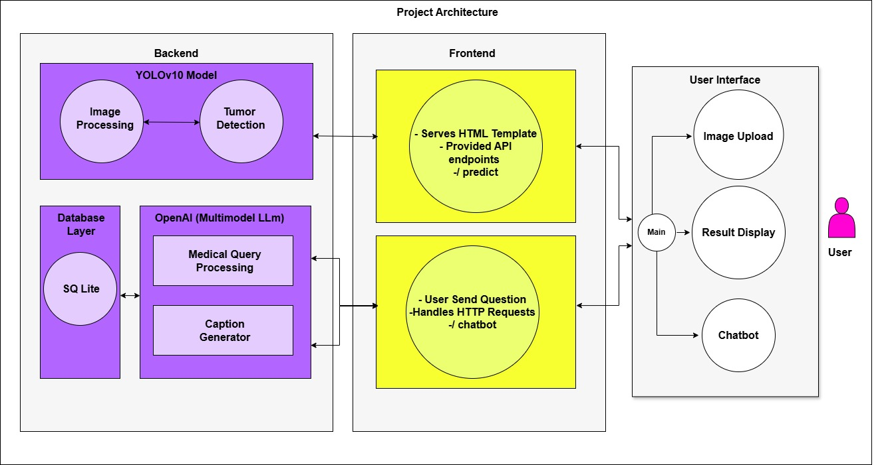

# Brain Tumor Detection and Classification Using YOLOv10 and AI Chatbot Using LLMs

## Overview
This project is a Flask web application that allows users to detect and classify brain tumors using the **YOLOv10 model**. Additionally, it features an **AI chatbot** powered by **LangChain** and **LLaMA models** to answer medical queries. The application integrates **state-of-the-art machine learning** and **natural language processing technologies**.

## Project Screenshot  
  

*(If the video doesn't play on GitHub, download and view it locally.)*

---

## Features
✅ **Brain Tumor Detection** – Detects and classifies brain tumors from MRI images using the YOLOv10 model.  
✅ **AI Chatbot** – Answers medical queries using a LangChain-based chatbot powered by **LLaMA** and **Pinecone**.  
✅ **Web Interface** – A user-friendly interface for uploading images, viewing results, and interacting with the chatbot.  
✅ **Image Annotation** – Annotates detected tumor regions on MRI images and returns the processed images.  
✅ **Fast & Efficient** – Optimized for real-time inference using deep learning models.  

---

## Project Structure
```
📂 brain_tumor_yolov10
│-- app.py                  # Main Flask application
│-- static/
│   │-- uploads/            # Stores uploaded images
│   │-- outputs/            # Stores annotated output images
│   │-- scripts.js          # JavaScript functions
│   │-- style.css           # Stylesheet for frontend
│-- weights/
│   │-- best.pt             # YOLOv10 model weights
│-- model/
│   │-- llama-2-7b-chat.ggmlv3.q4_0.bin  # LLaMA model for AI chatbot or use any other llm 
│-- templates/
│   │-- index.html          # Main web page
│-- .env/                   # Stores API keys
│-- README.md               # Project documentation
```

---

## Requirements
Make sure you have the following installed:

- **Python** (>=3.8)
- **Flask** (for web application)
- **LangChain** (for chatbot functionality)
- **Pinecone** (for vector storage)
- **Hugging Face Transformers** (for AI model inference)
- **Ultralytics (YOLOv10)** (for tumor detection)
- **Matplotlib** (for image processing)
- **Torch** (for deep learning)

---

## Installation

### **1. Clone the Repository**
```bash
git clone https://github.com/Sanket117/brain_tumor_yolov10.git
cd brain_tumor_yolov10
```

### **2. Create a Virtual Environment**
```bash
python -m venv venv
# For Windows
venv\Scripts\activate
# For Linux/Mac
source venv/bin/activate
```

### **3. Install Dependencies**
```bash
pip install -r requirements.txt
```

### **4. Run the Flask Application**
```bash
python app.py
```

The application will be available at `http://127.0.0.1:4000/`.

---

## Usage
1. **Upload an MRI scan** of the brain on the web interface.  
2. **The model detects and classifies** the tumor, highlighting the affected region.  
3. **Use the AI Chatbot** to get additional medical insights related to brain tumors.  

---

## Future Improvements
🚀 **Enhance chatbot knowledge base**  
🚀 **Improve model accuracy with more training data**  
🚀 **Deploy the application on cloud platforms (AWS/GCP)**  

---

## License
This project is **open-source** and available under the **MIT License**.

## Project Architecture  
 
---

## Contributors
👨‍💻 **[Your Name]** – Developer & AI Engineer  
📧 **Contact:** nsksanketsatpute@gmail.com  
🔗 **LinkedIn:** [Your LinkedIn Profile](https://www.linkedin.com/in/sanket-satpute/)  

---
